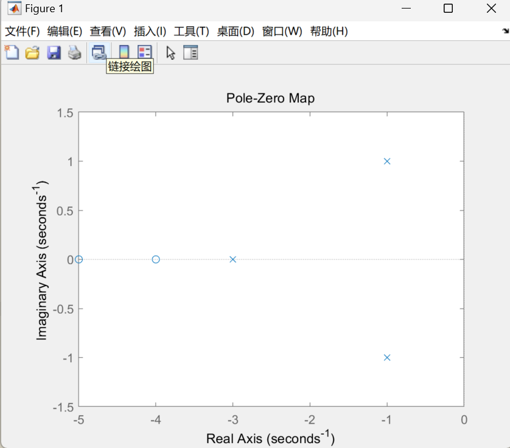
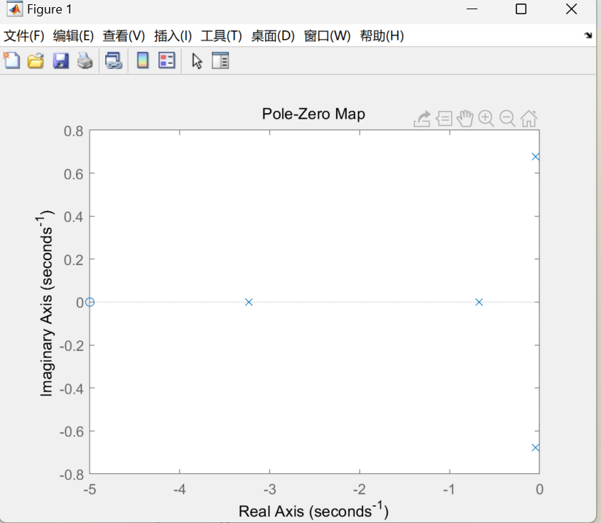

# 第一次实验
## 实验目的
    1. 掌握利用 MATLAB 建立控制系统模型的方法。
    2. 掌握系统的各种模型表述及相互之间的转换关系。
    3. 学习和掌握系统模型连接的等效变换
## 实验原理
- 系统的模型描述了系统的输入、输出变量以及内部各变量之间的关系，表征一个系统的模型有很多种，如微分方程、传递函数、状态空间方程等。这里主要介绍系统多项式型传递函数（TF）模型、零极点型传递函数（ZPK）模型和状态空间方程（SS）模型
    ### 传递函数（TF）模型
    传递函数是描述线性定常系统输入-输出关系的一种最常用的数学模型，其表达式一般为$G(s) = \frac{b_ms^m +b_{m-1}s^{m-1}+ +b_1s1+b_0}{a_ns^n +a_{n-1}s^{n-1}+ +a_1s^1+a_0}$


    在 MATLAB 中，直接使用行向量分子分母多项式的表示系统，即
    num = [bm, bm-1, … b1, b0]
    den = [an, an-1, … a1, a0]
    调用 tf 函数可以建立传递函数 TF 对象模型，调用格式如下：
    Gtf = tf(num,den)
    Tfdata 函数可以从 TF 对象模型中提取分子分母多项式，调用格式如下：
    [num,den] = tfdata(Gtf)返回 cell 类型的分子分母多项式系数
    [num,den] = tfdata(Gtf,'v') 返回向量形式的分子分母多项式系数
    ### 零极点增益（ZPK）模型
    传递函数因式分解后可以写成
    $G(s) = \frac{k(s-z_1)(s-z_2)...(s-zm)}{(s-p_1)(s-p_2)...(s-p_n)}$
    式中， z1, z2 ,… , zm 称为传递函数的零点， p1, p2 ,… , pn 称为传递函数的极点，k为传递系数(系统增益).在 MATLAB 中，直接用[z,p,k]矢量组表示系统，其中 z，p，k 分别表示系统的零极
    点及其增益，即：
    z=[z1,z2,…,zm]; 
    p=[p1,p2,…,pn]; 
    k=[k];
    调用 zpk 函数可以创建 ZPK 对象模型，调用格式如下：
    Gzpk = zpk(z,p,k)
    同样，MATLAB 提供了 zpkdata 命令用来提取系统的零极点及其增益，调用格式如下：
    [z,p,k] = zpkdata(Gzpk) 返回 cell 类型的零极点及增益
    [z,p,k] = zpkdata (Gzpk,’v’) 返回向量形式的零极点及增益
    函数 pzmap 可用于求取系统的零极点或绘制系统的零极点图，调用格式如下：
    pzmap(G) 在复平面内绘出系统模型的零极点图。
    [p,z] = pzmap(G) 返回的系统零极点，不作图。
    ### 状态空间（SS）模型
    由状态变量描述的系统模型称为状态空间模型，由状态方程和输出方程组成：$\left\{\begin{aligned}\dot{x}&= Ax + Bu\\y&=Cx + Du\end{aligned}\right.$
    其中：x 为 n 维状态向量；u 为 r 维输入向量； y 为 m 维输出向量； A 为 n×n 方阵，称为
    系统矩阵；B 为 n×r 矩阵，称为输入矩阵或控制矩阵；C 为 m×n 矩阵，称为输出矩阵；D
    为 m×r 矩阵，称为直接传输矩阵。
    在 MATLAB 中，直接用矩阵组[A,B,C,D]表示系统，调用 ss 函数可以创建 SS 对象模型，调用格式如下：
    Gss = ss(A,B,C,D)
    同样，MATLAB 提供了 ssdata 命令用来提取系统的 A、B、C、D 矩阵，调用格式如下：
    [A,B,C,D] = ssdata (Gss) 返回系统模型的 A、B、C、D 矩阵
    ###  三种模型之间的转换
    上述三种模型之间可以互相转换，MATLAB 实现方法如下
    - TF 模型→ZPK 模型：zpk(SYS)或 tf2zp(num,den)
    - TF 模型→SS 模型：ss(SYS)或 tf2ss(num,den)
    - ZPK 模型→TF 模型：tf(SYS)或 zp2tf(z,p,k)
    - ZPK 模型→SS 模型：ss(SYS)或 zp2ss(z,p,k)
    - SS 模型→TF 模型：tf(SYS)或 ss2tf(A,B,C,D)
    - SS 模型→ZPK 模型：zpk(SYS)或 ss2zp(A,B,C,D)
## lab1
```matlab
% 建立传递函数模型
num = [2 18  40];
den = [1 5  8 6];
G = tf(num, den)

% 建立零极点增益模型
[z, p, k] = tf2zp(num, den)

% 建立状态空间方程模型
[A, B, C, D] = tf2ss(num, den)

% 绘制零极点图
pzmap(G)
```
### 结果

 
## lab2
```matlab
% 建立传递函数模型
num = [2 18  40];
den = [1 5  8 6];
G = tf(num, den)

% 建立零极点增益模型
[z, p, k] = tf2zp(num, den)

% 建立状态空间方程模型
[A, B, C, D] = tf2ss(num, den)

% 绘制零极点图
pzmap(G)
```
### 结果


## lab3
```matlab
% 建立传递函数模型
G1 = tf([2 6 5], [1 4 5 2])
G2 = tf([1 4 1], [1 9 8 0])
G3 = zpk([-3,-7], [-1,-4,-6], 5)
sys_tf = series(series(G1, G2), G3)

% 输出总传递函数
sys_tf
```
### 结果
```matlab
sys_tf =
 
  10 (s+3) (s+3.732) (s+7) (s+0.2679) (s^2 + 3s + 2.5)
  ----------------------------------------------------
           s (s+1)^4 (s+2) (s+4) (s+6) (s+8)
```
## lab4
```matlab
% 建立传递函数模型
G1 = tf([1], [1 1])
G2 = tf([1], [0.5 1])
G3 = tf([3],[1])

sys_par = parallel(G1, G2);
sys_ser = series(sys_par, G3);
G = sys_ser;
H = tf([1], [0.5 1]);
sys_cl = feedback(G, H)
```
### 结果
```matlab
sys_cl =
 
       2.25 s^2 + 7.5 s + 6
  -------------------------------
  0.25 s^3 + 1.25 s^2 + 6.5 s + 7
```
## lab5
```matlab
G1 = tf([2],[1,1,0])
H1 = zpk([-3],[-2],1)
sys1 = feedback(G1, H1,1)
G2 = tf([10],[1,1])
G = series(G2,sys1)
H = tf([5,0],[1,6,8])
sys = feedback(G,H)
```
### 结果
```matlab
sys =
 
                         20 (s+2)^2 (s+4)
  --------------------------------------------------------------
  (s+2) (s-0.3234) (s^2 - 0.6067s + 3.089) (s^2 + 8.93s + 24.02)
```
## 收获和体会
- chatgpt真好用
- 学到了使用matlab进行系统建模