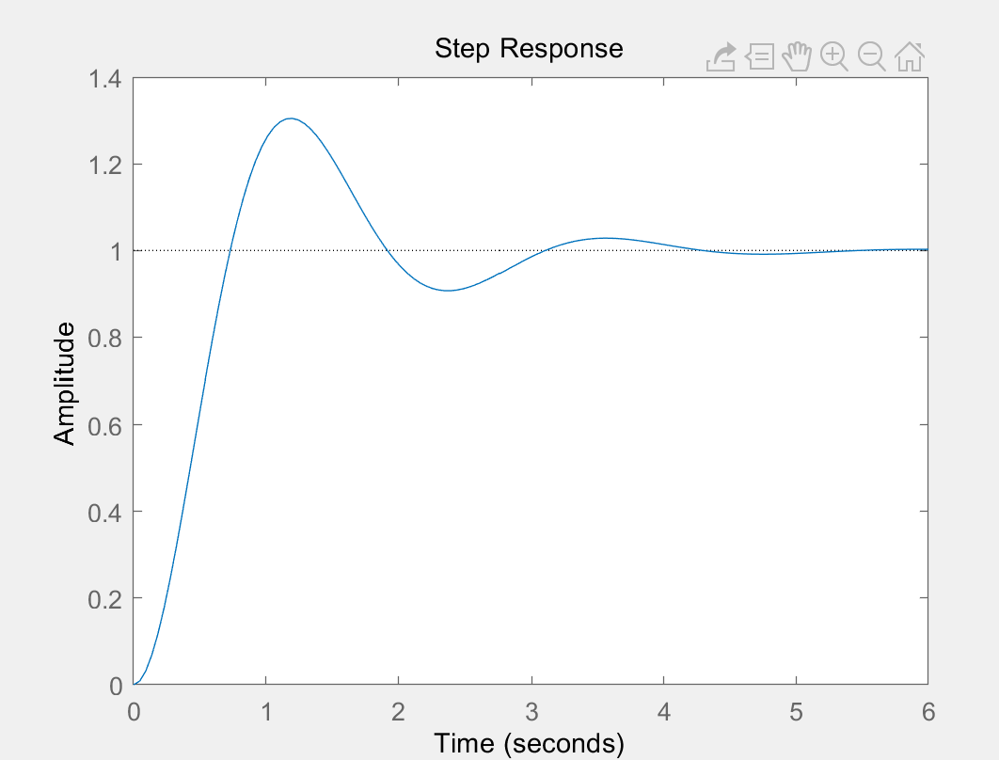
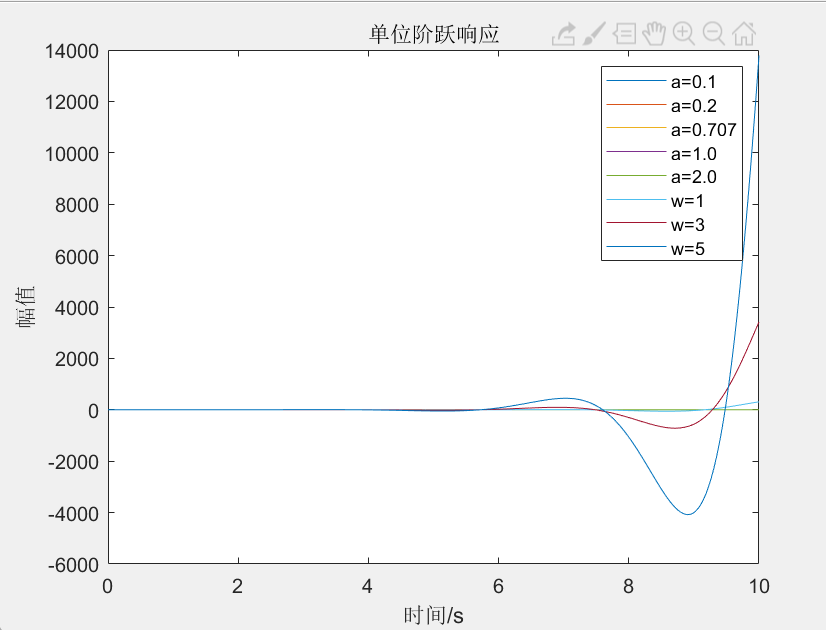
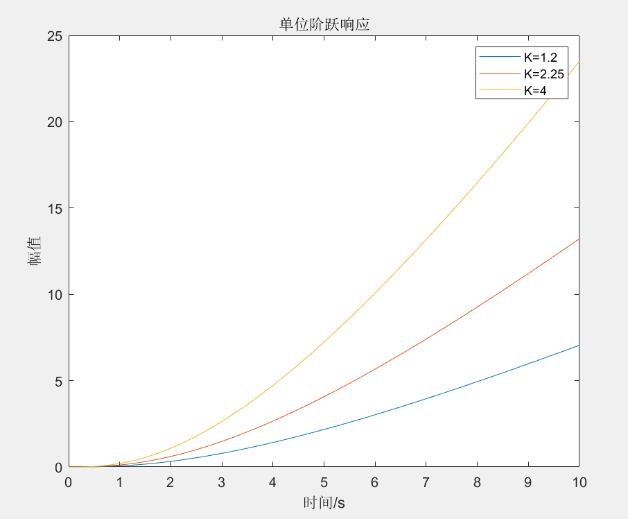
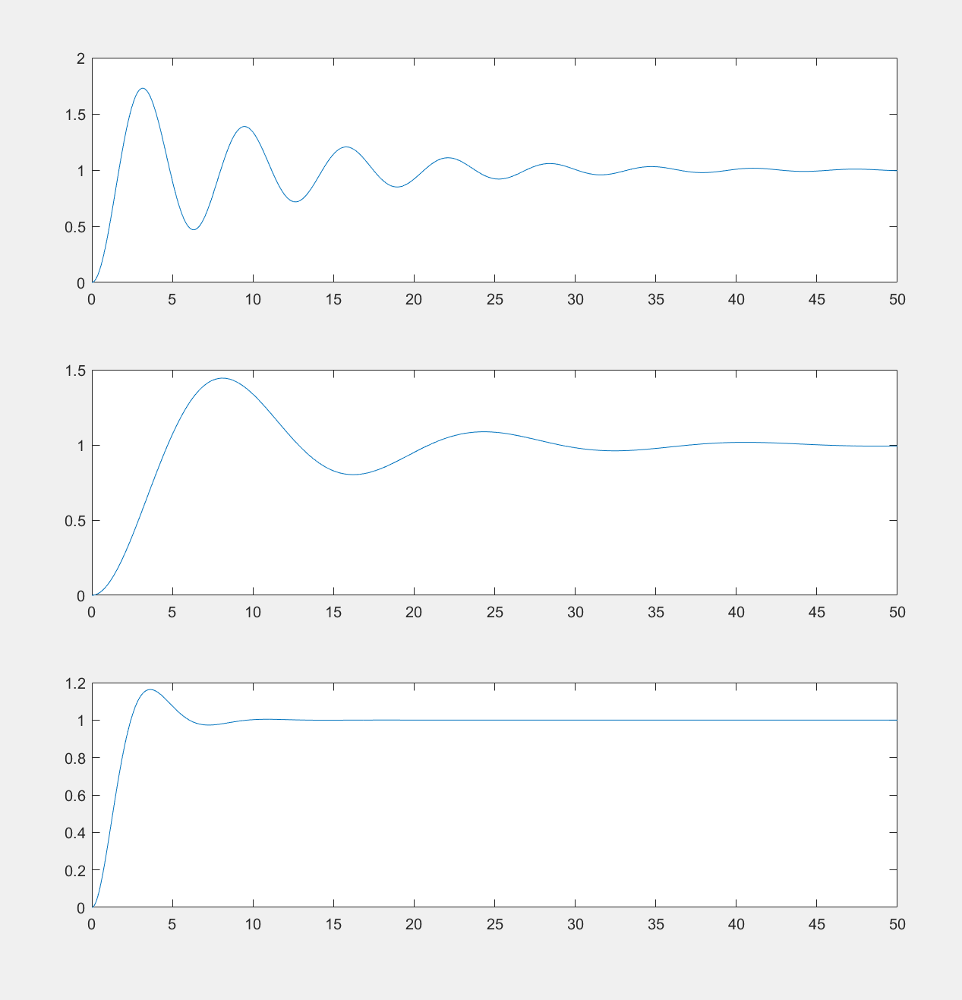

# 第二次实验
## 实验目的
  1.学习和掌握利用 MATLAB进行系统时域响应求解和仿真的方法。
  2.考察二阶系统的时间响应，研究二阶系统参数对系统暂态特性的影响。
## 实验原理
- 系统的暂态性能指标
  - 控制系统的暂态性能指标通常以一组时域量值的形式给出，这些指标通常根据系统的单位阶跃响应给出定义。常见的指标包括：
    1.延迟时间 td：响应曲线首次到达稳态值的50%所需的时间。
    2.上升时间 tr：响应曲线从稳态值的10%上升到90%所需要的时间，对于欠阻尼系统，指响应曲线首次到达稳态值所需的时间。
    3.峰值时间 tp：响应曲线第一次到达最大值的时间。
    4.调整时间 ts：响应曲线开始进入并保持在允许的误差(±2%或±5%)范围内所需要的时间。
    5.超调量：响应曲线的最大值和稳态值之差，通常用百分比表示。即(ymax - yss)/yss。
  - 在 MATLAB 中求取单位阶跃响应的函数为 step，可以使用不同的调用格式来绘制响应曲线或返回响应的数值向量及其对应的时间向量。在响应曲线上用鼠标读取关键点或通过搜索曲线对应的数值向量中关键点来确定系统的暂态性能指标。
- LTI Viewer工具
  - 在 MATLAB 中提供了线性时不变系统仿真的工具 LTI Viewer，可以方便地观察系统的响应曲线和性能指标。在命令窗口中键入 ltiview 即可启动 LTI Viewer。LTI Viewer 工具界面主要包括以下部分：
    - 系统输入、输出信号的绘图区域
    - 显示系统的单位阶跃响应曲线和暂态性能指标的区域
    - 显示系统的频率响应曲线和稳态性能指标的区域
  - 在 LTI Viewer 工具中，可以通过拖拽系统图标、添加信号源、修改系统参数等方式来构建和调整系统模型。同时，可以使用工具栏上的按钮来控制仿真的开始、暂停、继续和停止。在仿真过程中，LTI Viewer 会实时更新系统的响应曲线和性能指标，方便用户观察和分析系统的动态特性。
## lab1
```matlab

% 已知前向通路传递函数 G(s) = 8/(s^2 + 2s)
num = [8];
den = [1 2 0];
G = tf(num, den);
% 求解闭环传递函数
Gc = feedback(G, 1);
% 绘制单位阶跃响应曲线
step(Gc);
% 求解暂态性能指标
stepinfo(Gc)

```
### 结果

 
## lab2
```matlab

问题1
W = 6;
a = [0.1, 0.2, 0.707, 1.0, 2.0];
w = [1, 3, 5];
t = 0:0.01:10;
for i = 1:length(a)
    G = tf(W^2,[1, 2*a(i)*W, W^2]);
    y = step(G,t);
    plot(t,y);
    hold on;
end
for i = 1:length(w)
    G = tf(w(i)^2,[1, 2*a*W, w(i)^2]);
    y = step(G,t);
    plot(t,y);
    hold on;
end
title('单位阶跃响应');
xlabel('时间/s');
ylabel('幅值');
legend('a=0.1','a=0.2','a=0.707','a=1.0','a=2.0','w=1','w=3','w=5');

问题2
K = [1.2, 2.25, 4];
t = 0:0.01:10;
for i = 1:length(K)
    G = tf(K(i),[0.5, 1])*tf(1,[4, 1]) * tf(1,[1,0]);
    y = step(G,t);
    plot(t,y);
    hold on;
end
title('单位阶跃响应');
xlabel('时间/s');
ylabel('幅值');
legend('K=1.2','K=2.25','K=4');

```
### 结果


## lab3
```matlab
G = tf([1],[5 1 0]);
t1 = linspace(0,50,500);
t2 = linspace(0,50,2500);
t3 = linspace(0,50,2500);

H1 = G*5;
H2 = G * tf(4,5);
H3_1 = 5*tf([1],[5,1]);
H3_2 = feedback(H3_1,0.8);
H3 = H3_2 * tf([1],[1,0]);

sys1 = feedback(H1,1);
sys2 = feedback(H2,1);
sys3 = feedback(H3,1);

t1 = linspace(0,50,500);
t2 = linspace(0,50,2500);
t3 = linspace(0,50,2500);

y1 = step(sys1,t1);
y2 = step(sys2,t2);
y3 = step(sys3,t3);
subplot(3,1,1);
plot(t1,y1);
subplot(3,1,2);
plot(t2,y2);
subplot(3,1,3);
plot(t3,y3);
stepinfo(y1,t1)
stepinfo(y2,t2)
stepinfo(y3,t3)
hold on;

```
### 结果

```matlab
ans1 = 
        RiseTime: 1.1023
    SettlingTime: 41.5687
     SettlingMin: 0.4682
     SettlingMax: 1.7284
       Overshoot: 73.7980
      Undershoot: 0
            Peak: 1.7284
        PeakTime: 3.2064

ans2 = 
        RiseTime: 3.1309
    SettlingTime: 42.4465
     SettlingMin: 0.8026
     SettlingMax: 1.4443
       Overshoot: 45.4114
      Undershoot: 0
            Peak: 1.4443
        PeakTime: 8.1032

ans3 = 
        RiseTime: 1.6377
    SettlingTime: 8.0763
     SettlingMin: 0.9058
     SettlingMax: 1.1630
       Overshoot: 16.3030
      Undershoot: 0
            Peak: 1.1630
        PeakTime: 3.6214

```
  - 控制系统H1的响应速度相对较慢，上升时间为1.1023s，调节时间为41.5687s，超调量较大（73.7980%），但静态误差较小（0）。
  - 控制系统H2的响应速度比H1要快，但上升时间仍然相对较长，为3.1309s。调节时间为42.4465s，超调量为45.4114%，但静态误差仍然为0。
  - 控制系统H3的响应速度最快，上升时间为1.6377s，调节时间为8.0763s，超调量为16.3030%，但静态误差仍然为0。同时，该控制系统的响应速度和超调量均优于前两种控制方式。

## 收获和体会
- 熟悉MATLAB控制系统工具箱的使用；
- 理解不同的系统建模方式，包括传递函数法和状态空间法；
- 理解闭环控制的基本原理和方法，包括反馈控制和前馈控制；
- 了解不同控制系统性能指标的含义和计算方法。